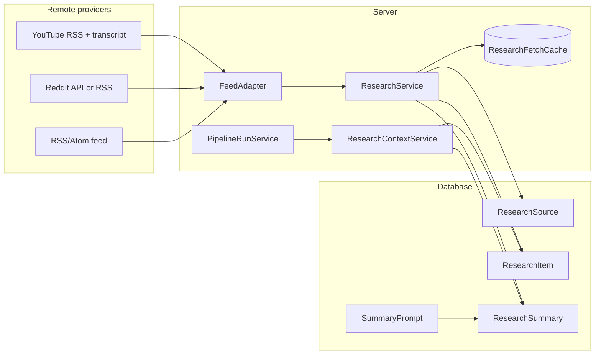

# Research Feeds

Research feeds are account-scoped data sources that collect external content (YouTube transcripts, Reddit digests, RSS articles), store it locally, optionally summarize it with AI, and expose it to pipeline prompts through slug-based references.

Pipeline runs **never** call YouTube, Reddit, or RSS directly. They read stored `ResearchItem` and `ResearchSummary` rows that were collected earlier via **check** or **sync**.

## Architecture



### Collection flow

1. **Create source** — `ResearchService.create()` resolves the remote identity (`externalId`), stores a `ResearchSource` row, and assigns a unique slug from the display name.
2. **Check source** — `ResearchService.checkLatest()` fetches via the type-specific adapter, deduplicates by `(sourceId, externalId)`, and inserts new `ResearchItem` rows.
3. **Summarize item** — `ResearchService.summarize()` runs a `SummaryPrompt` against item `content` via OpenAI and upserts a `ResearchSummary`.
4. **Pipeline run** — `ResearchContextService.resolveForPipeline()` loads the latest (or date-pinned) item per referenced slug, ensures a summary exists, and merges contexts into run variables for `PromptRenderService`.

## Supported feed types

| `sourceType` | Input examples | Resolved `externalId` | What gets stored |
|---|---|---|---|
| `youtube` (default) | `https://www.youtube.com/@handle`, `/channel/UC…`, `/c/…`, `/user/…` | YouTube channel ID (`UC…`) | Latest video title, URL, publish date, transcript when available |
| `reddit` | `wallstreetbets`, `r/stocks`, `https://www.reddit.com/r/stocks` | Subreddit name (lowercase) | One daily digest item: top posts for today (`{subreddit}-{YYYY-MM-DD}`) |
| `rss` | Any valid RSS/Atom URL | The feed URL itself | Up to 20 latest articles (title, URL, date, excerpt/content) |

### Adapter interface

All providers implement `FeedAdapter` in `apps/server/src/services/adapters/`:

```ts
interface FeedItem {
  externalId: string
  title: string
  itemUrl: string
  publishedAt: Date
  content: string
}

interface FeedAdapter {
  resolveSource(sourceUrl: string): Promise<string | null>
  fetchLatest(externalId: string, sourceUrl: string): Promise<FeedItem[]>
}
```

`getAdapter(sourceType)` in `FeedAdapter.ts` maps `youtube` → `YoutubeAdapter`, `reddit` → `RedditAdapter`, `rss` → `RssAdapter`.

## Data model

| Model | Purpose |
|---|---|
| `ResearchSource` | Feed config: name, slug, `sourceType`, `sourceUrl`, `externalId`, `status`, `defaultSummaryPromptId`, `lastChecked` |
| `ResearchItem` | One collected piece of content (video, digest, article) |
| `ResearchSummary` | AI summary of an item for a specific `SummaryPrompt` |
| `SummaryPrompt` | Reusable summarization template; user prompt must include `{transcript}` |
| `ResearchFetchCache` | One-hour DB cache for remote resolve/fetch results (including failures) |

### Slugs

Slugs are derived from the source **name** at creation time (`toSlug()` → lowercase, non-alphanumeric to `-`, max 60 chars). Collisions within an account get a numeric suffix (`ziptrader-2`). Slugs are stable after creation and are used in pipeline prompt references.

### Source status

| Status | Behavior |
|---|---|
| `active` (default) | Included in account **Sync All** |
| `paused` | Skipped by Sync All; can still be checked manually |

## API

All routes require session auth. See `packages/api-spec/openapi.yaml` (`tags: [research]`) for full schemas.

### Research sources

| Method | Path | Handler | Description |
|---|---|---|---|
| `GET` | `/api/accounts/{accountId}/research` | `listResearchSources` | List sources for an account |
| `POST` | `/api/accounts/{accountId}/research` | `createResearchSource` | Create source |
| `GET` | `/api/research/{sourceId}` | `getResearchSource` | Get by ID or slug |
| `PATCH` | `/api/research/{sourceId}` | `updateResearchSource` | Update name, category, URL, status |
| `DELETE` | `/api/research/{sourceId}` | `deleteResearchSource` | Delete source and cascade items |
| `POST` | `/api/research/{sourceId}/check` | `checkResearchSource` | Fetch latest remote content |

**Create body:**

```json
{
  "name": "ZipTrader",
  "sourceType": "youtube",
  "sourceUrl": "https://www.youtube.com/@ZipTrader",
  "category": "financial"
}
```

**Check response:**

```json
{
  "data": {
    "checked": true,
    "newItem": true,
    "newCount": 1,
    "item": { "id": "...", "title": "...", "externalId": "..." }
  }
}
```

`checked: false` means the source URL could not be resolved to an `externalId`.

### Research items and summaries

| Method | Path | Description |
|---|---|---|
| `GET` | `/api/research/{sourceId}/items?page=&limit=` | Paginated item list (default 15, max 50) |
| `GET` | `/api/research/items/{itemId}` | Item with full `content` |
| `GET` | `/api/research/items/{itemId}/summaries` | All summaries for an item |
| `POST` | `/api/research/items/{itemId}/summarize` | Generate summary `{ "promptId": "..." }` |

Summary statuses: `pending`, `processing`, `done`, `failed`. Items without `content` always summarize to `failed`.

### Summary prompts (global)

| Method | Path | Description |
|---|---|---|
| `GET` | `/api/summary-prompts` | List prompts |
| `POST` | `/api/summary-prompts` | Create prompt |
| `PATCH` | `/api/summary-prompts/{promptId}` | Update prompt |
| `DELETE` | `/api/summary-prompts/{promptId}` | Delete prompt |

Summary prompts are **not** account-scoped. Seed data in `packages/db/prisma/seed.ts` provides defaults such as **News Brief** (`isDefault: true`).

User prompts must include `{transcript}` — at summarize time this is replaced with up to 12,000 characters of item content.

### Account sync

| Method | Path | Description |
|---|---|---|
| `POST` | `/api/accounts/{accountId}/sync` | Check all **active** research sources, then start all non-paused pipelines that have enabled agents and no run in progress |

Implemented in `AccountService.sync()`.

## SDK hooks

`packages/sdk/src/hooks/useResearch.ts`:

| Hook | API |
|---|---|
| `useResearchSources(accountId)` | List sources |
| `useResearchSource(idOrSlug)` | Get one source |
| `useCreateResearchSource()` | Create |
| `useUpdateResearchSource()` | Update |
| `useDeleteResearchSource()` | Delete |
| `useCheckResearchSource()` | Check for new content |
| `useResearchItems(sourceId, page, limit)` | Paginated items |
| `useResearchItem(itemId)` | Single item |
| `useResearchSummaries(itemId)` | Item summaries |
| `useSummarizeResearchItem()` | Run summarization |

`packages/sdk/src/hooks/useSummaryPrompts.ts` covers summary prompt CRUD.

After OpenAPI changes, regenerate types: `pnpm --filter @project/sdk generate`.

## Web UI

| Route / surface | Component | Purpose |
|---|---|---|
| `/accounts/:accountSlug` | `AccountDetailPage` | Lists research feeds; **Add research source**; **Sync All** |
| `/accounts/:accountSlug/research/:sourceSlug` | `ResearchSourcePage` | Feed detail: info, items, summary prompts |
| Pipeline builder → Agents | `PromptField` | **Insert ref** menu for `{slug.summary}` / `{slug.date}` |

### Research source page layout

- **Info** (`ResearchInfoPanel`) — metadata, edit, manual check, delete, slug reference hint
- **Items** (`ResearchSidebar` + `ResearchItemPanel`) — paginated history, per-item summaries, date-pinned ref display
- **Summary Prompts** (`PromptsPanel`) — global prompt CRUD (reachable from any source page sidebar)

Creation flow: `CreateResearchSourceDialog` → `POST` → navigate to `/accounts/{slug}/research/{sourceSlug}`.

## Connecting feeds to pipelines

Any account research source can be referenced by its **slug** in agent prompts as a dynamic variable.

### Reference syntax

| Reference | Resolves to |
|---|---|
| `{ziptrader.summary}` | Latest item for slug `ziptrader`, using the feed's pipeline summary style |
| `{ziptrader.date}` | `YYYY-MM-DD` publish date |
| `{ziptrader.title}` | Latest item title |
| `{ziptrader.url}` | Latest item URL |
| `{ziptrader.content}` | Raw collected content / transcript |
| `{ziptrader.2026-06-18.summary}` | Item published on that UTC date, same pipeline summary style |
| `{wallstreetbets.2026-06-18.title}` | Title pinned to a specific date |

### Pipeline summary style

Each feed may set `defaultSummaryPromptId`. Resolution order:

1. Feed's `defaultSummaryPromptId` when set
2. Global default `SummaryPrompt` (`isDefault`, then `sortOrder`, then `createdAt`)
3. Auto-generate on first pipeline run if no stored summary exists for that item + prompt

The feed detail UI exposes **Pipeline summary style**. The builder **Insert ref** menu shows the effective prompt name under each `{slug.summary}` entry.

Resolution logic lives in `ResearchContextService` + `PromptRenderService.render()`:

- `{root}` looks up `variables[root]`; objects stringify via `.summary` when present.
- `{root.field}` walks nested paths on the resolved context object.
- Date-pinned refs are detected by scanning agent prompts for `{slug.YYYY-MM-DD.field}` patterns before the run.

On run start, `PipelineRunService` calls `resolveForPipeline()` and merges results into `runVariables` alongside user-supplied pipeline variables. If a referenced source has no items, or summarization fails, the run errors before agents execute.

## Remote fetch caching

`ResearchService` caches all adapter calls for **one hour** in `ResearchFetchCache`:

| Cache key pattern | Covers |
|---|---|
| `research:resolve:{sourceType}:{sourceUrl}` | `resolveSource()` |
| `research:fetch:{sourceType}:{externalId}` | `fetchLatest()` |

Failed remote responses (403, 429, 500, etc.) are cached too, so repeated checks within the TTL do not hammer providers.

Reddit-specific behavior (`RedditAdapter`):

1. OAuth client-credentials when `REDDIT_CLIENT_ID` + `REDDIT_SECRET` are set
2. Falls back to subreddit RSS (`/r/{name}/top/.rss?t=day`) on API failure or missing credentials

YouTube (`YoutubeAdapter` → `YoutubeService`):

- Resolves handles via channel page HTML or `/channel/UC…` paths
- Fetches latest video from `https://www.youtube.com/feeds/videos.xml?channel_id=…`
- Pulls transcript via `youtube-transcript` (empty string if unavailable)

RSS (`RssAdapter`):

- Validates URL with `rss-parser` on resolve
- Stores up to 20 items per check; content truncated to 8,000 chars

## Environment variables

| Variable | Used by | Required |
|---|---|---|
| `OPENAI_API_KEY` | `ResearchService.summarize()` | Yes, for summaries and on-demand run resolution |
| `REDDIT_CLIENT_ID` | `RedditAdapter` OAuth | No (RSS fallback) |
| `REDDIT_SECRET` | `RedditAdapter` OAuth | No |
| `REDDIT_USER_AGENT` | Reddit HTTP requests | No (defaults to `AgentPress/1.0 research-aggregator`) |

## Adding a new feed type

1. **Adapter** — Create `apps/server/src/services/adapters/MyAdapter.ts` implementing `FeedAdapter`.
2. **Registry** — Add a `case` in `getAdapter()` (`FeedAdapter.ts`).
3. **OpenAPI** — Extend `sourceType` enum on `ResearchSource` and create body in `packages/api-spec/openapi.yaml`.
4. **SDK** — Regenerate; update `useCreateResearchSource` union if needed.
5. **Web** — Add type to `SOURCE_TYPES` in `CreateResearchSourceDialog.tsx` and labels in `ResearchInfoPanel.tsx` `TYPE_LABELS`.
6. **Seed / docs** — Optional sample source in `seed.ts`.

Keep `externalId` stable and unique per logical item so `checkLatest()` deduplication works.

## Key files

| Area | Path |
|---|---|
| Service (CRUD, check, summarize, cache) | `apps/server/src/services/ResearchService.ts` |
| Pipeline context resolution | `apps/server/src/services/ResearchContextService.ts` |
| Run integration | `apps/server/src/services/PipelineRunService.ts` |
| Account sync | `apps/server/src/services/AccountService.ts` |
| HTTP handlers | `apps/server/src/handlers/research.ts` |
| Summary prompt handlers | `apps/server/src/handlers/summary-prompts.ts` |
| Adapters | `apps/server/src/services/adapters/` |
| Prisma models | `packages/db/prisma/schema.prisma` |
| OpenAPI | `packages/api-spec/openapi.yaml` |
| SDK hooks | `packages/sdk/src/hooks/useResearch.ts`, `useSummaryPrompts.ts` |
| Web features | `apps/web/src/features/research/` |
| User-facing overview | `README.md` (Research Feeds section) |

## Typical developer workflow

1. Create a research source on an account (`POST /api/accounts/{id}/research`).
2. Check it (`POST /api/research/{sourceId}/check`) and confirm items appear.
3. Open an item and run a summary prompt (or let a pipeline run trigger auto-summarization).
4. Attach the feed in pipeline Setup and reference `{slug.summary}` in agent prompts.
5. Start a pipeline run — verify resolved variables include research context.
6. Use **Sync All** on the account page to check all active feeds and kick ready pipelines in one step.

For local development, `pnpm db:seed` loads sample sources and summary prompts. Use **Check** on a seeded source before running pipelines that depend on `{ziptrader.summary}` or similar references.
